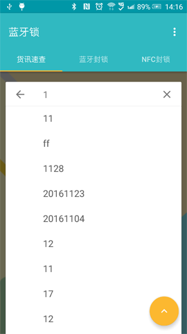

# 蓝牙锁
> 物流安全 Material Design

## 更新
> 2016/03/13  Version 1.0 

## 简介
> 蓝牙锁，将蓝牙4.0低功耗技术应用于物流运输监控管理系统中，运用GPS定位和GPRS通信技术，将物流运输过程中货物的实时位置，蓝牙锁的安全状态、闭合状态等信息通过GPRS服务周期上传至远程服务器平台，供以服务器将信息及时告知给用户，用户便能远程掌握运输信息，同时用户通过APP可设置锁的监控上传周期、箱号等信息，为用户提供信息化物流服务。

## 分类
> 物流安全监控

## 截图

### 登录

### 货讯速查

### 扫描设备

### 蓝牙操作

#### 配置设备

#### 设备状态信息

#### 设备位置信息

